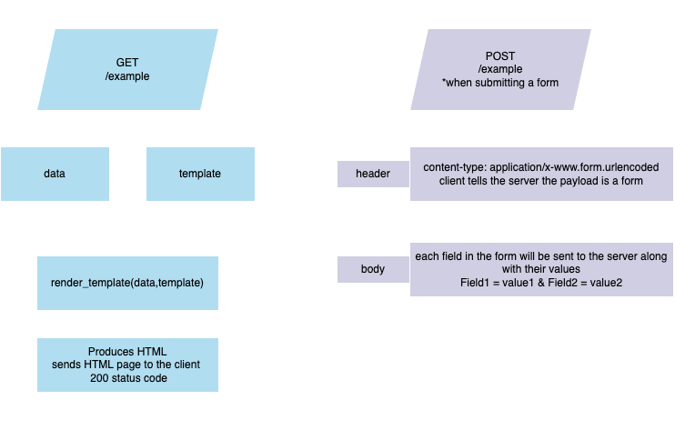

# Blood bank management system
#### Video Demo:  <URL HERE>
#### Description: 

## Introduction

I am proud to present my final project for the CS50's Introduction to Computer Science course. This project gave me the opportunity to connect almost every topic covered in the course.For instance, Python, SQL, HTML, CSS, and Flask. Including powerful Flask extensions such as flask_login, flask_sqlalchemy, and WTForms. 
The idea of building a blood bank management system came from the desire to connect my current studies in Computer Science to my professional background in Biomedical Science.

## Objectives

This project aims to develop an application that allows Physicians to place a blood request for their patients to a blood bank. To fulfill that request, the blood bank professional can search in the database for blood bag availability that matches the requirements for that request. 
Even more, if eventually there are no blood bags available to fulfill a request, the blood bank professional can look to the database for donors with that blood type and invite them to donate.


## How I planned the web app  


## Resolving the dependencies

Before running the application for the first time, use `pip` to resolve the dependencies:

```shell
$ pip install -r requirements.txt
```

## Running the application

```shell
$ export FLASK_APP=app/app.py
$ export FLASK_ENV=development
$ flask run
```

Or, as a single line:

```shell
$ FLASK_APP=app/app.py FLASK_ENV=development flask run
```

The application will be available at `http://127.0.0.1:5000`.

## Live refresh

When working with static content, such as CSS files, it's nice to have browser live refresh for quick development cycles. To run the application, use:

```shell
$ python live_refresh.py
```

And the application will be available at `http://127.0.0.1:5000`.

# About the dependencies

### Flask

A simple yet powerful Python web framework, it provides the technologies, tools, and modules used to build the actual functionalities of the web app. It includes functions to parse requests individually and requires the program's code to be organised in a certain way as follows:  

- `app.py`  
    It's the file where the Python code for the webserver lives. The web server can parse or analyse HTTP request headers and return different pages based on the route.
- `requeriments.txt`  
    This file contains a list of required libraries for the application.
- `static/`  
    It's a directory of static files, such as images and CSS files.
- `templates/`  
    It's a directory for HTML files that uses jinja syntax, a template engine. Using a template to set a basic layout for a page allows us to define the header once and keep it consistent over all the pages.

</br>

### flask_login

It is a user session management handles tasks such as:
- `logging in`, 
- `logging out` and 
- `remembering sessions`.

</br>

### flask_sqlalchemy  

- SQLAlchemy is an `Object Relational Mapper(ORM)` for python.
- The function of an ORM is to convert objects (classes) to SQL tables that can be stored in an SQL database, and it saves each instance of that object under the corresponding table. So an `ORM acts as an abstraction layer over a database`.
- `ORMs` make software development products easier as they `handle all SQL commands and schemas`.

</br>

### WTForms

Forms are how the internet works and how we typically get input from the user, whether it is a button, a text box, or a dropdown menu.  
WTForms is a flexible forms validation and rendering library for Python web development. It can work with whatever web framework and template engine you choose. The WTForms built-in module of flask provides an alternative way of designing forms providing the interactive user interface for the user.

# What each of the files contains and does?

- `app\`  
 `app.py`  
 Initiate the Flask application with all the required configurations for the extensions flask_login and flask_sqlalchemy.  
 `extensions.py`  
 Create instances of the main class of each extension.  
 `utils.py`  
 Reload the User object from the user ID stored in the session.  
 Create tables in the database before the first request.  
 Authorize access by roles.  
 `app_setup.py`  
 Create tables and populate the database to make it easy to test the app.  
 `forms.py`  
 Define Classes which are representations of forms. They are logical models of the user forms with fields, labels, and validations.  
 `models.py`  
 Define Classes for representing the application data model, which will also to the database tables.

- `routes\`  
Where the logical content for implementing all the functionalities of each route of the application lives.  
The files are organised in this way:  
`auth.py`, `blood_request.py`, `donor.py`, `home.py`, `user.py`.

- `static\`  
All the CSS stylesheets of the application.  
The files are organised in this way: `form.css`, `header.css`, `home.css`, `style.css`, `tables.css`.

- `templates\`  
Under templates there is a folder for each of the main application features which are: `auth`, `blood_request`, `donor`, `home`, `user`.

# Features

### Home

It is a dashboard that shows how many blood bags of which blood type is available in the blood bank stock. There are also blood request statistics, with how many pending, approved, and rejected requests.

### Users

The application was designed with two kinds of users in mind, Physicians working in hospitals that are going to make requests. And the blood bank professionals, will have an admin login to fulfill the Physicians' requests. 
Log in as an admin user is possible to perform the following actions:
 - `Add new` users
 - `Edit` data from already registered users
 - `Search` by name or role for the users listed in the database

<!-- Screenshots or Gif? -->

### Donors

The donor tab is available only for admin users. It lists all the donors that made at least one blood donation at that blood bank. The actions allowed in this tab are:
- `Add new` donors
- `Search` for donors already registered
- Edit any new information about the donor by clicking on the `Edit` button
- Register a new donation at the `Donate` button.

<!-- Screenshots or Gif? -->

### Blood requests

Both users, admin, and Physicians have permission to access this tab.  
However, `Physicians can place a new request`, while admin profiles can not do that. On the other hand, at this tab on the `admin profile`, the user can take actions, such as `viewing the blood request and working on it to fulfillment`. 

<!-- Screenshots or Gif? -->

### Change password
The user is also able to change their password in the `password tab`.   

</br>

# Lessons learned

Defining a route in Flask, we can specify parts of it that will be converted into Python variables and passed to the view function.

```python
@app.route('/user/id/<int:user_id>')
def profile(user_id):
    pass
```

This table shows Flask's built-in URL converters:
| Converter | Description                                     |
|-----------|-------------------------------------------------|
| string    | Accepts any text without a slash (the default). |
| int       | Accepts integers.                               |
| float     | Like int but for floating point value           |
| path      | Like string but accepts slashes.                |
</br>

## GET / POST



</br>

## request.args vs request.form

- `request.args`  
Contains the URL encoded parameters, the part in the URL after the question mark, from a GET request.
- `request.form`  
contains POST data, the form parameters.
